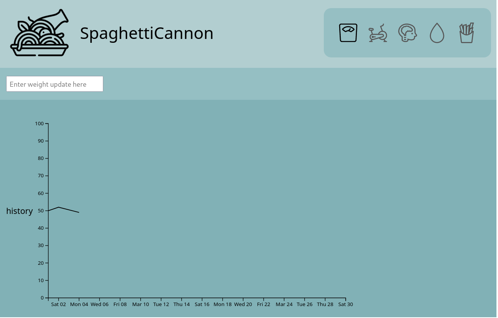

# SpaghettiCannon


[](https://discord.gg/jhYWWpNJ3v)

**A personal quality of life tracker.**

Track your weight, mood, food, exercise, periods, in a self-hosted way, while keeping your own data.



This project is very much in the ideation sage, and is being developed with discussions on the OliveTin Discord ([Invite Link](https://discord.gg/jhYWWpNJ3v)). Join if you'd like to contribute ideas!

## Try it

```
docker run -p 4337:4337 ghcr.io/jamesread/spaghetticannon:latest
```

Then point your web browser at http://yourServer:4337.

## No Nonsense Open Source

* **No analytics** - of users, or software versions, or tracking of any kind.
* **No company** - there isn't a company backing the project, or with anything to gain, just a small community of enthusiasts doing this in their spare time.
* **No cloud servers** - it will run offline or entirely within a LAN with no problems.
* **No paid extras** - no premium versions, upgrades or "open source core" only.
* **No adverts or tracking cookies** - nobody needs adverts with personal data.
* **No hidden development process** - everything is publicly available on GitHub and Discord.
* **No people excluded** - accessibility is a #1 design consideration.
* **No second thoughts to security** - encryption on by default, quite a lot of automated code scanning being used. Responsible disclosure process in place.
* **Free, Open Source Software** (AGPLv3).
